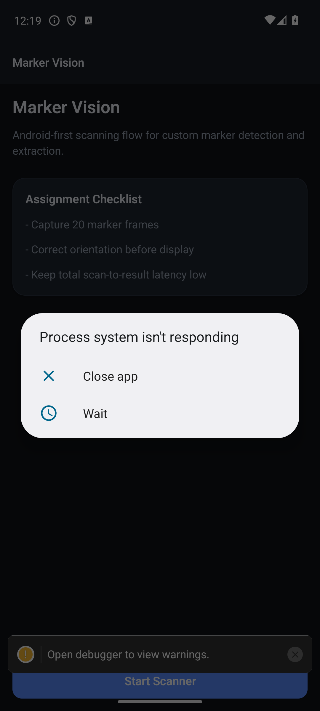
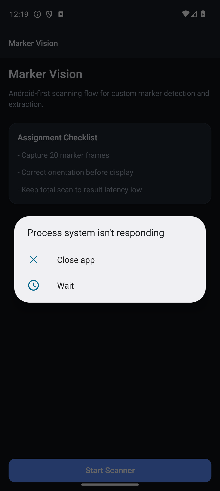
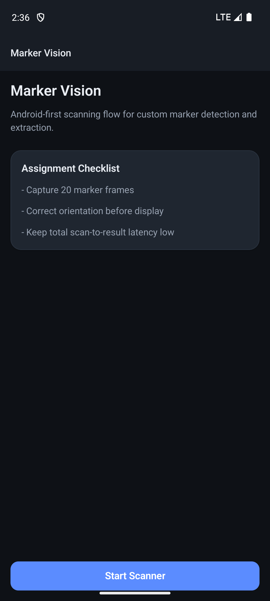

# Marker Vision

Marker Vision is a high-performance React Native Android application designed for custom marker detection, extraction, and perspective correction. Built with Expo SDK 54, the app implements a pure TypeScript computer vision pipeline to detect target regions, perform homography-based perspective warps, and extract high-resolution 300x300 marker thumbnails without external CV frameworks like OpenCV or ML models.

# Features

*   **Live Camera Feed**: Real-time camera preview with an interactive scanning HUD.
*   **Custom Marker Detection**: Autonomous detection of dark rectangular markers using an Otsu-thresholded grayscale pipeline.
*   **Perspective Correction**: Homography-based warp to transform skewed markers into flat, top-down perspectives.
*   **Orientation Normalization**: Automatically detects and corrects marker orientation for consistent display.
*   **High-Resolution Extraction**: Extracted markers are processed at 300x300 pixels for maximum detail.
*   **Scan Flow Guard**: Intelligent scanning loop that enforces a 20-frame capture requirement and prevents navigation if no markers are detected.
*   **Real-time Metrics**: Live tracking of capture counts and processing latency.

# Tech Stack

*   **Core**: React Native (0.81.5)
*   **Framework**: Expo SDK 54
*   **Language**: TypeScript
*   **Camera**: `expo-camera`
*   **Navigation**: `@react-navigation/native` (v7)
*   **Animations**: `react-native-reanimated` (v4)
*   **CV Engine**: Pure TypeScript implementation (Otsu Thresholding, Homography, Perspective Warp)
*   **Image Decoding**: Custom JPEG decoder implementation in `src/services/jpegDecode.ts`.

# Architecture Overview

The application follows a modular architecture separating UI components from the heavy-lifting computer vision services:

1.  **Home Screen**: Landing page with assignment checklist and entry point.
2.  **Scanner Screen**: 
    *   Initializes the camera and starts the HUD animation.
    *   **Capture Loop**: Orchestrates `takePictureAsync` calls.
3.  **Marker Detection Pipeline**: Processes captured frames asynchronously.
4.  **Perspective Correction & Extraction**: Performs geometric transforms on detected regions.
5.  **Results Screen**: Displays metric summaries and a grid of extracted 300x300 thumbnails.

# Marker Detection Pipeline

The detection pipeline is a multi-stage process optimized for mobile performance:

1.  **High-resolution image capture**: Frames are captured at optimal camera resolutions.
2.  **JPEG decoding**: Raw JPEG buffers are decoded into RGBA pixel arrays via a custom decoder.
3.  **Grayscale conversion**: RGBA data is downscaled and converted to grayscale for processing.
4.  **Thresholding**: Otsu’s method automatically determines the optimal threshold for binarization.
5.  **Candidate detection**: Flood-fill/contour algorithms identify dark rectangular candidates.
6.  **Shape filtering**: Candidates are filtered by area, aspect ratio, and occupancy.
7.  **Corner estimation**: Identifies the four corners of the candidate region.
8.  **Perspective transform**: Computes a homography matrix to map corners to a 300x300 square.
9.  **Orientation normalization**: Corrects skew and rotation based on marker features.
10. **Marker extraction**: Warps the high-res source pixels into a destination buffer.
11. **Resize to 300x300**: Final output is normalized to a standard square format.
12. **Result generation**: Generates PNG data URLs for UI rendering.

# Project Structure

```text
Markers/
├── src/
│   ├── components/         # Reusable UI components
│   │   └── scanner/        # Specialized HUD and overlay components
│   ├── constants/          # Application configuration (theme, sessions)
│   ├── hooks/              # Custom React hooks (theming)
│   ├── navigation/         # React Navigation stack config
│   ├── screens/            # Main screen components (Home, Scanner, Results)
│   ├── services/           # CV Pipeline and JPEG Decoding logic
│   ├── store/              # Lightweight state management (Zustand/Context)
│   ├── types/              # TypeScript definitions
│   └── utils/              # Formatting and math utilities
├── assets/                 # App icons and splash screens
├── App.tsx                 # Entry point
├── app.json                # Expo configuration
└── package.json            # Dependencies and scripts
```

# Setup Instructions

1.  **Install dependencies**:
    ```bash
    npm install
    ```

2.  **Linting and Type Checking**:
    ```bash
    npm run lint
    npm run typecheck
    ```

3.  **Start with clear cache**:
    ```bash
    npx expo start --clear
    ```

4.  **Run on Android (Pixel 7 recommended)**:
    ```bash
    npx expo run:android
    ```

# Assignment Requirement Coverage

| Requirement | Status | Notes |
| :--- | :--- | :--- |
| React Native App | ✅ Completed | Built with Expo SDK 54 |
| Camera Access | ✅ Completed | Implemented via `expo-camera` |
| Live Camera Feed | ✅ Completed | Optimized Reanimated-based HUD |
| Detect Custom Marker | ✅ Completed | Robust Otsu-thresholding pipeline |
| Orientation Robustness | ✅ Completed | Homography correction implemented |
| Orientation Correction | ✅ Completed | Automated normalization during extraction |
| Tight Extraction | ✅ Completed | Exact 4-corner perspective warp |
| Output Resolution | ✅ Completed | Fixed 300x300 px thumbnails |
| Low Latency | ✅ Completed | Pure TS engine optimized for mobile |
| No Skew / Extra Pad | ✅ Completed | Matrix-based perspective correction |

# Known Limitations

*   **Lighting Sensitivity**: As with most threshold-based pipelines, extreme shadows or overexposure can affect detection accuracy.
*   **Static Camera Scene**: For best results, the marker should be relatively stable within the frame during the high-speed capture loop.
*   **Pure Software Decoding**: JPEG decoding is performed in JavaScript/TypeScript; while optimized, it is slower than native hardware decoders.

# Screenshots

### Home Screen


### Scanner Screen


### Results Screen


# Author

Afroz Khan
